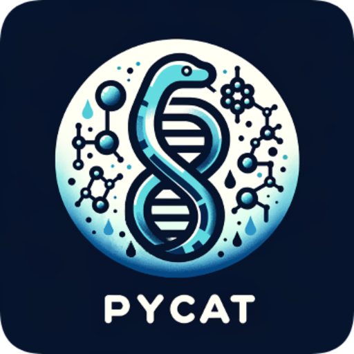

# PyCAT-Napari



PyCAT (Python Condensate Analysis Toolbox) is an open-source application built on [napari](https://napari.org/) for analyzing biomolecular condensates in biological images. It provides a comprehensive suite of tools for fluorescence image analysis, particularly focused on condensate detection, measurement, and characterization.

## Table of Contents

- [Features](#features)
- [Quick Start](#quick-start)
- [System Requirements](#system-requirements)
- [Installation](#installation)
- [Getting Started](#getting-started)
- [Examples](#examples)
- [Documentation](#documentation)
- [Contributing](#contributing)
- [License](#license)
- [Support](#support)

## Features

PyCAT-Napari provides comprehensive tools for biological image analysis:

| Feature Category | Capabilities | Requirements |
|-----------------|--------------|--------------|
| Image Processing | - Condensate detection and segmentation<br>- Fluorescence intensity analysis<br>- Multi-channel analysis | Basic |
| Data Analysis | - Feature extraction<br>- Measurement tools<br>- Statistical analysis | Basic |
| Data Export | - CSV export<br>- Excel compatibility<br>- Figure generation | Basic |
| Advanced Tools | - Additional bio-image analysis tools<br>- Extended functionality | [devbio] extra |

## System Requirements

### Compatibility Matrix

| Platform      | Python | Status    | Notes                    |
|--------------|---------|-----------|--------------------------|
| Windows 10/11 | 3.9     | Tested    | Logo display issue      |
| Mac M1/ARM   | 3.9     | Tested    | Requires specific torch |
| Mac Intel    | 3.9     | Untested* | Should work            |
| Linux        | 3.9     | Untested* | Should work            |

*While untested, these platforms should work with standard installation.

### Minimum Requirements
- **Python Version**: 3.9.x (Required)
  > ⚠️ **Important**: PyCAT-Napari is currently only compatible with Python 3.9. Other versions are not supported in this release. Future releases may aim to expand to more versions. 
- RAM: 8GB (16GB recommended)
- Disk Space: ~2GB (including dependencies)
- GPU: Not required (CPU-only processing)

## Quick Start

PyCAT requires Python 3.9 and a package/environment manager. We recommend using Mambaforge for package and environment management, but we include instructions for alternative methods.  Before installing PyCAT-Napari, follow this quick assessment to determine your setup needs:

### Initial Setup Check

#### 1. Do you have Python installed?

Check Python Installation

Run this command in your terminal (mac)/command prompt (anaconda prompt)/powershell(windows):
```bash
python --version
```

If you get a version number: ✅ You have Python installed

If you get an error: ❌ See [Python Installation Guide](#python-installation)

#### 2. Do you have Conda or Mamba installed?

Check Your Environment Manager

```bash
conda --version
# or
mamba --version
```

If you get a version number: ✅ Proceed to installation

If you get an error: ❌ See [Package Manager Installation](#package-manager-installation)

#### 3. Are you familiar with Python environments?

If yes: ✅ Proceed to [Installation](#installation)

If no: ❌ Read our quick environment guide below

**Python Package and Environments Info**

Think of environments like separate containers for different projects - they help avoid conflicts and keep things organized. Don't worry, they're simpler than they sound!

Python environments help you:
- Keep projects separate
- Avoid version conflicts
- Ensure reproducibility

Package Manager Choice
> 💡 **Why Mambaforge?** While Anaconda is popular, Mambaforge offers:
> - Faster package installation and dependency resolution
> - Lighter initial installation (no bloat)
> - Same conda commands you may already know
> - Everything you need, nothing you don't

Already have Anaconda? That's fine! You can skip the Mambaforge installation and use your existing setup.

Basic environment commands:
```bash
# Create new environment with Python 3.9
conda create -n pycat-env python=3.9

# Activate the environment
conda activate pycat-env

# Verify you're in the right environment
python --version  # Should show Python 3.9.x
```

## Installation

### Basic Installation

1. Create and activate a new environment:
```bash
# Create environment
conda create -n pycat-env python=3.9

# Activate environment
conda activate pycat-env
```

2. Install PyCAT-Napari:
```bash
pip install pycat-napari
```

### Platform-Specific Installations

#### Windows
```bash
pip install pycat-napari
```
Note: The application logo may not display correctly on Windows.

#### Mac M1/ARM
```bash
pip install "pycat-napari[arm-mac]"
```

### Optional Features

```bash
# Development tools
pip install "pycat-napari[dev]"

# Additional bio-image analysis tools (recommended)
pip install "pycat-napari[devbio-napari]"
```

The devbio-napari package adds numerous additional image analysis tools. Learn more at [devbio-napari documentation](https://github.com/haesleinhuepf/devbio-napari).

### Alternative Installation Methods

💡 If you encounter issues with the standard installation, use our tested environment files. We provide complete environment files that match our development package setup (no dev tools installed though, please install those separately if youre trying to install a dev version for a fork or pull request):

```bash
# Windows
mamba env create -f pycat-devbio-napari-env-x86-windows.yml

# Mac M1/ARM
mamba env create -f pycat-devbio-napari-env-arm-mac.yml
```

### Verifying Installation & Optional Testing 

After installation, verify PyCAT-Napari is working correctly:

#### 1. Basic Checks
```bash
# Activate your environment
conda activate pycat-env

# Verify Python version
python --version  # Should show 3.9.x

# Test basic import
python -c "import pycat; print('PyCAT import successful!')"

# Launch GUI (basic smoke test)
run-pycat  # Should open the GUI window
```

#### 2. Optional Test Suite

PyCAT comes with a basic test suite covering core functionality:
```bash
# Install test dependencies if you haven't
pip install "pycat-napari[test]"

# Run all tests with coverage report
pytest
```

The test suite checks:

- Package imports and resource accessibility
- GUI initialization (non-interactive tests only)
- Core image processing functions
- Data management and file I/O
- Feature analysis tools

💡 Note: GUI-interactive tests are skipped as they require manual interaction.

3. What Success Looks Like
 >- All import tests pass
 >- Basic GUI launches without errors
 >- Image processing tests complete successfully
 >- No failures in core functionality tests

If you encounter any failures, check:

1. Python version (must be 3.9.x)
2. Environment activation
3. Complete installation of dependencies
4. Troubleshooting Guide
5. Check the issues 

Still having problems installing or running the program? Open a github issue. If you need urgent help, reach out to us and we will try to get back to you as soon as possible. 


## Getting Started

## 🛠️ Usage

PyCAT-Napari offers two ways to analyze your data: through a user-friendly GUI or programmatically via Python code.

### GUI Application

[Screenshot: PyCAT main interface with key areas labeled]

Launch PyCAT's graphical interface with:
```bash
run-pycat
```

#### Basic GUI Workflow

1. **Load Data**
   - Click `File > Open` or drag-and-drop files
   - Supported formats: TIFF, CZI, PNG, JPG
   - Multiple files can be loaded simultaneously

2. **View and Process**
   - Use the layer list to manage loaded images
   - Access tools through the left sidebar
   - Adjust parameters in the right panel

3. **Analyze**
   - Select analysis methods from the Analysis menu
   - Configure analysis parameters
   - Results appear in new layers

4. **Export**
   - Save processed images via `File > Save`
   - Export measurements as CSV/Excel
   - Generate analysis reports

[Screenshot: Annotated workflow example]

### Programmatic API

For automated analysis or integration into existing workflows:

```python
# Launch the GUI programmatically
from pycat import run_pycat_func
run_pycat_func()

#or 

# Use analysis tools programmatically
import pycat
from pycat.analysis import process_image  # Example import

# Load and process an image
image_path = "my_image.tif"
results = process_image(
    image_path,
    method="condensate_detection",
    parameters={"threshold": 0.5}
)

# Access results
measurements = results.measurements
processed_image = results.image

# Save results
results.save("output_directory")
```

> 💡 **Tip**: While both interfaces offer the same capabilities, the GUI is recommended for exploratory analysis and parameter optimization, while the API is ideal for batch processing and reproducible workflows.

For detailed API documentation, see our [API Reference](link-to-docs).


## 📊 Example Workflows

PyCAT includes several pre-configured workflows for common analysis scenarios. Here are some typical use cases:

### In-Cellulo Condensate Analysis

[Screenshot: Single condensate analysis workflow showing input → processing → results]

```python
# Example code snippet
from pycat import analyze_single_condensate

results = analyze_single_condensate(
    image_path="sample.tif",
    channel=0,  # First channel
    roi_size=50  # pixels
)
```

#### Typical Steps:
1. Load fluorescence microscopy image
2. Select region of interest (ROI)
3. Run intensity analysis
4. Extract measurements
5. Generate visualizations

### Multi-Channel Colocalization

[Screenshot: Multi-channel analysis showing overlay and correlation plots]

```python
# Example code snippet
from pycat import analyze_colocalization

results = analyze_colocalization(
    image_path="multi_channel.tif",
    channels=[0, 1],  # Analyze first two channels
    method="pearson"  # Correlation method
)
```

#### Key Features:
- Automatic channel alignment
- Multiple correlation metrics
- Statistical significance testing
- Publication-ready figures

### Example Datasets

Download sample data to try these workflows:
- `example_single.tif`: Single condensate example
- `example_multi.tif`: Multi-channel example
- `example_batch/`: Batch processing example set

> 💡 **Note**: Example datasets include both raw data and expected results for validation.

[Link to example data repository]


## 📘 Documentation

> 🚧 Full documentation is in progress. Please check back soon for complete docs!

Current documentation includes:

### Reference Materials
- [API Documentation](link-to-api)

## 📓 Notebooks

Interactive Jupyter notebooks demonstrate advanced analysis workflows:

### Analysis Examples
- **pycat_plotting.ipynb**
  - Combine and visualize results
  - Generate publication-ready plots
  - Estimate saturation concentrations (C-sat)
  - Perform statistical analysis

### Data Processing
- **int_truncated_dfs.ipynb**
  - Filter intensity ranges
  - Batch process datasets
  - Custom parameter selection

> 💡 **Tip**: Install additional packages required by notebooks with:
> ```bash
> pip install pycat-napari[notebooks]
> ```

## 💻 Development

### Setting Up Development Environment

1. Clone the repository:
```bash
git clone https://github.com/BanerjeeLab-repertoire/pycat-napari.git
cd pycat-napari
```

2. Create development environment:
```bash
# Windows
conda env create -f pycat-devbio-napari-env-x86-windows.yml

# Mac M1/ARM
conda env create -f pycat-devbio-napari-env-arm-mac.yml
```

3. Install development dependencies:
```bash
pip install -e ".[dev]"
```

### Running Tests
```bash
# Install test dependencies
pip install -e ".[test]"

# Run tests with coverage
pytest
```

## 🤝 Contributing

We welcome contributions! See [CONTRIBUTING.md](CONTRIBUTING.md) for guidelines.

Key areas for contribution:
- Bug fixes and feature improvements
- Documentation and examples
- Test coverage expansion
- Platform compatibility testing

## 📄 License

PyCAT-Napari is licensed under the BSD 3-Clause License. See [LICENSE](LICENSE) for details.

### Third-Party Libraries
See [THIRD_PARTY_LICENSES.txt](THIRD_PARTY_LICENSES.txt) for details about dependencies.

## 📚 Citation

If you use PyCAT-Napari in your research, please cite:

```bibtex
@software{neureuter2024pycat,
  author = {Neureuter, Christian},
  title = {PyCAT-Napari: Python Condensate Analysis Toolbox},
  year = {2024},
  publisher = {GitHub},
  url = {https://github.com/BanerjeeLab-repertoire/pycat-napari}
}
```

## 🆘 Support & Troubleshooting

### Common Issues

1. **Installation Problems**
   - Verify Python 3.9 installation
   - Check platform-specific requirements
   - Use provided environment files

2. **GUI Issues**
   - Update graphics drivers
   - Check PyQt5 installation
   - Verify napari compatibility

3. **Analysis Errors**
   - Confirm input file format
   - Check memory availability
   - Verify parameter ranges

### Getting Help

- Search [existing issues](https://github.com/BanerjeeLab-repertoire/pycat-napari/issues)
- Open a [new issue](https://github.com/BanerjeeLab-repertoire/pycat-napari/issues/new)
- Join our [discussion forum](link-to-forum)

## 🔄 Project Status & Roadmap

Current Version: 1.0.0

### Recent Updates
See [CHANGELOG.md](CHANGELOG.md) for detailed version history.

### Roadmap
- Extended file format support
- GPU acceleration
- Advanced visualization tools
- Expanded analysis methods

## 🙏 Acknowledgments

This project was developed by Christian Neureuter in the Condensate Biophysics Lab (Banerjee Lab) at SUNY Buffalo.

### Key Dependencies
- [napari](https://napari.org/) - Image visualization
- [scikit-image](https://scikit-image.org/) - Image processing
- [numpy](https://numpy.org/) - Numerical computing
- [pandas](https://pandas.pydata.org/) - Data analysis

### Special Thanks
- Banerjee Lab members for testing and feedback
- napari community for viewer framework
- Open source community for supporting libraries
