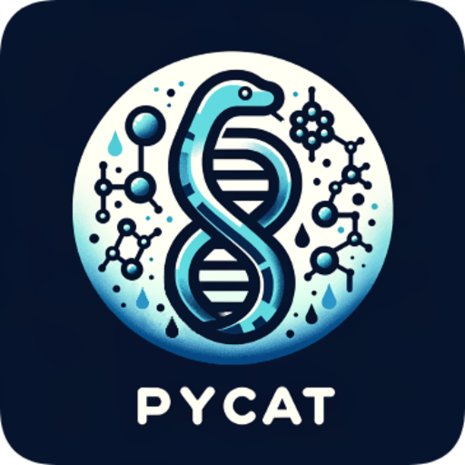
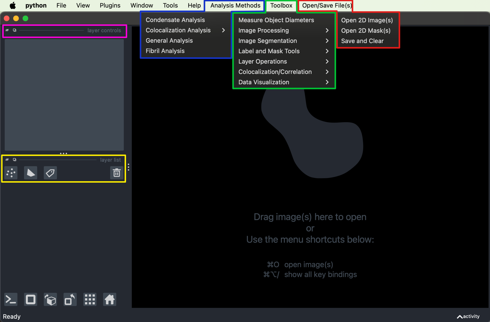
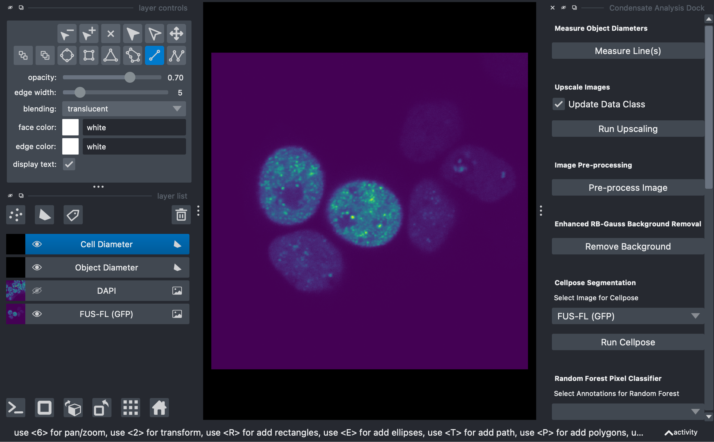
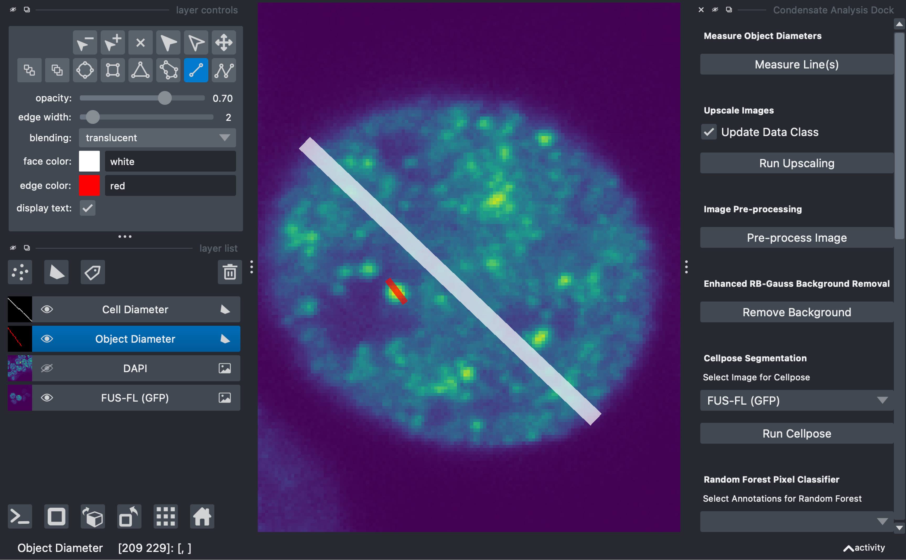
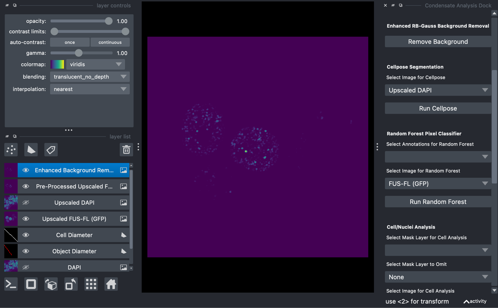
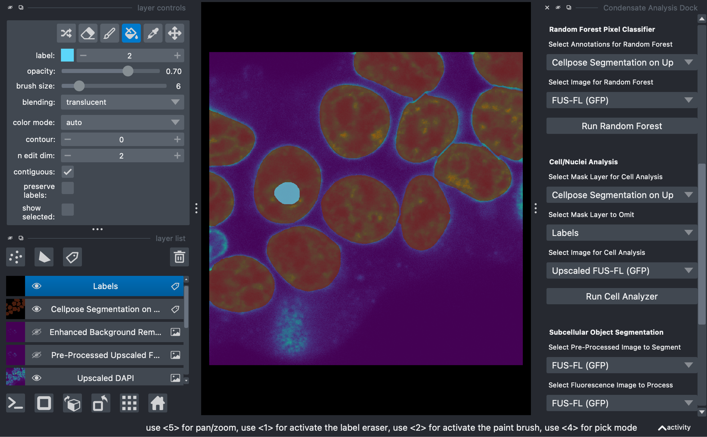
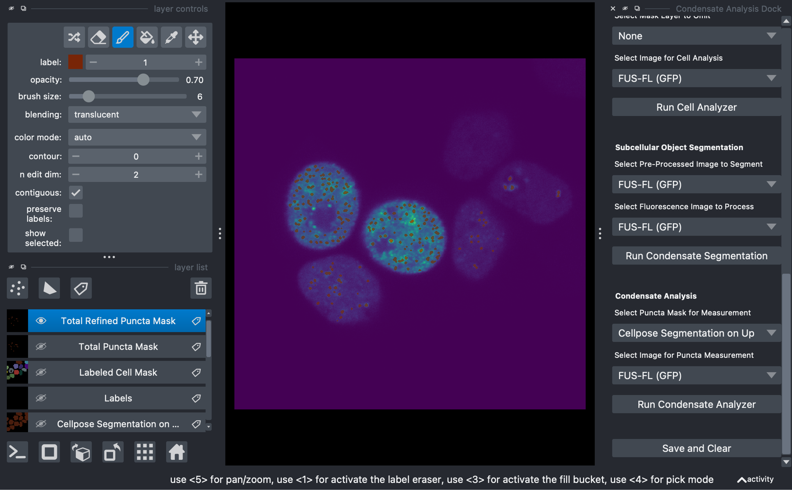
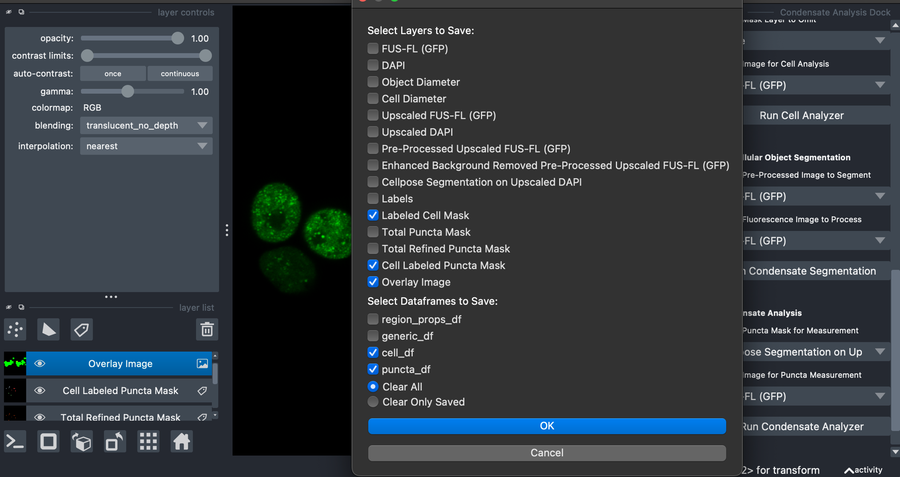

# PyCAT-Napari




PyCAT (Python Condensate Analysis Toolbox) is an open-source application built on [napari](https://napari.org/) for analyzing biomolecular condensates in biological images. It provides a comprehensive suite of tools for fluorescence image analysis, particularly focused on condensate detection, measurement, and characterization. PyCAT aims to provide a low/no-code solution, accessible to researchers with varying levels of programming experience.

## Table of Contents

- [Features](#features)
- [System Requirements](#system-requirements)
- [**Getting Started / Installation**](#getting-started) ← **start here**
  - [Step 1 — Install Miniforge](#step-1--install-miniforge-gets-you-python--a-package-manager)
  - [Step 2 — Create a workspace](#step-2--create-a-workspace-for-pycat)
  - [Step 3 — Install PyCAT](#step-3--install-pycat)
  - [Step 4 — Launch PyCAT](#step-4--launch-pycat)
- [Optional: Speed & Extra Features](#optional-speed--extra-features)
- [TrackMate Integration (Optional)](#trackmate-integration-optional)
- [Usage](#usage)
- [Documentation](#documentation)
- [Notebooks](#notebooks)
- [Development](#development)
- [Contributing](#contributing)
- [License](#license)
- [Citation](#citation)
- [Support & Troubleshooting](#support--troubleshooting)
  - [NumPy 2.0 Compatibility](#numpy-20-compatibility)
- [Project Status & Roadmap](#project-status--roadmap)
- [Acknowledgments](#acknowledgments)

## Features

PyCAT-Napari provides a comprehensive suite of tools for biological image analysis, spanning cellular and in-vitro condensate systems, 2D/Z-stack/time-series acquisitions, and both fluorescence and brightfield modalities.

| Category                     | Capabilities                                                                                              |
|------------------------------|----------------------------------------------------------------------------------------------------------|
| **Image Processing and Segmentation** | - Versatile toolbox with common image processing and analysis functions.<br>- Specialized condensate segmentation and object filtering algorithms.<br>- Optimized for in-cellulo analysis in challenging biological datasets.<br>- Pseudo-3D (tri-planar) filtering for Gaussian/Gabor/DoG linear filters — applies the same 2D kernel along XY, XZ, and YZ (or XY/XT/YT for time series) planes and averages the result, exploiting genuine correlation between adjacent Z-slices or oversampled frames.<br>- Optional GPU acceleration (rolling-ball background removal and morphological operations) via CuPy. |
| **Quantitative Region Analysis**      | - Simple and intuitive layer and ROI mask design.<br>- Extensive ROI feature analysis, including area, intensity, shape, texture, and more.<br>- Advanced colocalization analysis:<br>&nbsp;&nbsp;&nbsp;- Object-based metrics: Jaccard Index, Dice Coefficient, Mander's coefficients, and distance analysis.<br>&nbsp;&nbsp;&nbsp;- Pixel-wise metrics: Pearson's R, Spearman's R, Li's ICQ, and more.<br>&nbsp;&nbsp;&nbsp;- Modified Costes analysis: Automated thresholds and statistical significance testing.<br>- Correlation function analysis: Auto- and cross-correlation functions with Gaussian fitting.<br>- Spatial metrology: nearest-neighbour distance, Ripley's L, pair correlation, Voronoi/Delaunay, convex hull, radial localization.<br>- Morphological complexity: fractal dimension, lacunarity, tortuosity, orientation order.<br>- Organizational metrics: spatial entropy, DBSCAN clustering, inter-condensate spacing, occupancy. |
| **Condensate Biophysics**             | - Mean-squared displacement (MSD) and anomalous diffusion fitting (D, α).<br>- Saturation concentration (C_sat) estimation via bimodal intensity decomposition and dilution-series lever-rule fitting.<br>- Fusion relaxation kinetics (τ = ηR/γ) and coarsening mechanism discrimination (Ostwald ripening vs. coalescence).<br>- Kaplan-Meier survival analysis for condensate lifetimes.<br>- Frame quality diagnostics that distinguish photobleaching from focal drift. |
| **Trajectory Tracking**               | - Greedy nearest-neighbour and Bayesian (Hungarian/LAP) trajectory linking with velocity-assisted prediction and gap closing.<br>- Merge/fission event detection.<br>- Optional bridge to real [TrackMate](https://imagej.net/plugins/trackmate/) (Jaqaman LAP tracker, Kalman tracker) via an embedded headless Fiji instance — see [TrackMate Integration](#trackmate-integration-optional). |
| **Time-Series & Z-Stack Analysis**    | - Lazy, zarr-backed loading and parallelized preprocessing for large multi-dimensional acquisitions (time series with nested Z-stacks, multi-position/multi-channel files).<br>- Keyframe Cellpose segmentation with nearest-keyframe propagation across time and IoU-based stitching across Z.<br>- Per-frame spatial metrics and drift correction.<br>- 3D condensate segmentation built on the validated 2D per-slice pipeline, linked into true 3D objects across Z. |
| **Batch Processing**                  | - Record-and-replay batch system: GUI actions are automatically recorded to a reusable JSON config.<br>- Headless replay across an entire folder of files with per-step error isolation (one bad file doesn't abort the run).<br>- Session reload: scan a previous output folder and restore all layers/dataframes without re-running analysis. |
| **Integrated Analysis Pipelines**     | - **Cellular Condensate Analysis** (Fluorescence & Brightfield): tailored for in-cellulo biomolecular condensates.<br>- **In Vitro Condensate Analysis** (Fluorescence & Brightfield): field-level statistics, droplet size distributions, C_sat estimation, and contact-angle measurement for coverslip droplet assays.<br>- **Time-Series Condensate Analysis**: full T·H·W pipeline with drift correction and per-frame spatial metrics.<br>- **Z-Stack (3D) Condensate Analysis**: 3D segmentation and volumetric metrics.<br>- **Colocalization Analysis Pipeline**: combines object-based and pixel-wise methods for robust colocalization studies.<br>- **General ROI Analysis Pipeline**: flexible pipeline for exploratory measurements.<br>- **Fibril Analysis Pipeline**: specialized for analyzing beta-amyloid fibers and fibril structures, with morphological complexity and organizational metrics built in. |


## System Requirements

### Compatibility Matrix

| Platform      | Python | Status    | Notes                    |
|--------------|---------|-----------|--------------------------|
| Windows 10/11 | 3.12    | Tested    | Logo display issue      |
| Mac M1/ARM   | 3.12    | Tested    | Requires specific torch |
| Mac Intel    | 3.12    | Untested* | Should work            |
| Linux        | 3.12    | Untested* | Should work            |

*While untested, these platforms should work with standard installation.

### Minimum Requirements
- **Python Version**: 3.12.x (Required)
  > ⚠️ **Important**: PyCAT-Napari requires Python 3.12 (supported range 3.12–3.13). Earlier versions, including 3.9, are no longer supported as of v1.5.39. 
- RAM: 8GB (16GB recommended; large time-series/Z-stack acquisitions benefit from more)
- Disk Space: ~100MB (including dependencies); optional TrackMate integration downloads an additional ~500MB–1GB Fiji distribution on first use
- GPU: Not required — PyCAT runs entirely on CPU by default. An NVIDIA GPU with CUDA is optional and used automatically when available (Cellpose segmentation, and rolling-ball/morphological operations via the `[gpu]` extra) for faster processing.

## Getting Started

> **New to Python or the terminal? Start here and go top to bottom.** This section takes you from a fresh computer to a running PyCAT window. You do **not** need to know how to code. Follow each step in order — copy each command into your terminal exactly as shown.

PyCAT needs two things: **Python 3.12** and a tool to manage it. If you don't have those yet, Step 1 sets them up. If you're already comfortable with conda/mamba environments, you can jump to [Step 3: Install PyCAT](#step-3--install-pycat).

---

### Step 1 — Install Miniforge (gets you Python + a package manager)

Miniforge is a small, free installer that gives you Python **and** the `mamba` command PyCAT uses to stay organized. It's the easiest starting point on every system.

1. Go to the **[conda-forge download page](https://conda-forge.org/download/)** and download the Miniforge installer for your computer (Windows, macOS Intel, macOS Apple Silicon, or Linux).
   - *Alternative:* you can also get the installers and detailed instructions from the **[Miniforge GitHub page](https://github.com/conda-forge/miniforge#miniforge3)**.
2. Run the installer and accept the defaults.
3. When it finishes, open a **new** terminal window:
   - **Windows:** open **Miniforge Prompt** from the Start menu (search "Miniforge").
   - **macOS / Linux:** open the **Terminal** app.

> 💡 **Already have Anaconda or Miniconda?** You can skip this step — anywhere these instructions say `mamba`, use `conda` instead. Everything else is the same.

<details>
<summary><b>How do I know it worked?</b> (click to expand)</summary>

<br>

In your new terminal window, type:

```bash
mamba --version
```

If you see a version number (e.g. `mamba 1.5.x`), you're ready for Step 2. If you get an error like "command not found," close the terminal, open a brand-new one, and try again — the installer only takes effect in terminals opened *after* it finishes.

</details>

---

### Step 2 — Create a workspace for PyCAT

This makes a clean, isolated "environment" so PyCAT's pieces don't collide with anything else on your computer. Copy these two commands into your terminal, one at a time:

```bash
# Create a new environment named "pycat-env" with Python 3.12
mamba create -n pycat-env python=3.12

# Turn it on (you'll do this every time before using PyCAT)
mamba activate pycat-env
```

When it's active, your terminal prompt will show `(pycat-env)` at the start of the line. That's how you know PyCAT's workspace is turned on.

<details>
<summary><b>What is an "environment," and why do I need one?</b> (click to expand)</summary>

<br>

Think of an environment as a separate, labeled box for one project. It keeps PyCAT's exact set of tools together and prevents version conflicts with other software. They're simpler than they sound — the two commands above are all you need. Every time you come back to use PyCAT, just open a terminal and run `mamba activate pycat-env` first.

</details>

---

### Step 3 — Install PyCAT

With `(pycat-env)` showing in your prompt, install PyCAT with **one** command for your system:

**Windows / Linux:**
```bash
pip install pycat-napari
```

**Mac (Apple Silicon — M1/M2/M3):**

On Apple Silicon, first install `llvmlite` and `numba` from conda-forge (they ship prebuilt Apple-Silicon binaries, so nothing has to compile), then install PyCAT:

```bash
conda install -c conda-forge llvmlite numba
pip install "pycat-napari[arm-mac]"
```

> **Why?** `numba` is a dependency, and if `pip` can't find a prebuilt `llvmlite`/`numba` for your Mac it will try to *compile* them from source — which fails with `llvmlite needs CMake tools to build` unless you have compiler tools installed. Installing them from conda-forge first avoids the build entirely. (If you ever still hit that error, add `cmake` to the conda install: `conda install -c conda-forge cmake llvmlite numba`.)

> On Windows, the app logo may not render perfectly — that's purely cosmetic and doesn't affect anything.

---

### Step 4 — Launch PyCAT

You're done installing. Start the program with:

```bash
run-pycat
```

The PyCAT window should open. 🎉 **That's the whole basic setup** — you can start using it now. See [Usage](#usage) for a walkthrough.

> ⚠️ **Remember for next time:** whenever you want to use PyCAT, open a terminal and run `mamba activate pycat-env` first, then `run-pycat`.

---

<!-- ========================= PAGE BREAK ========================= -->

## Optional: Speed & Extra Features

Everything below is **optional**. PyCAT works fully without any of it. Come back here later if you want faster segmentation or extra tools.

<details>
<summary><b>⚡ GPU Acceleration (much faster Cellpose segmentation)</b> (click to expand)</summary>

<br>

Cellpose segmentation runs on CPU by default, but is **much faster on an NVIDIA GPU**. To enable GPU acceleration, install the CUDA build of PyTorch **after** installing PyCAT (make sure `(pycat-env)` is active):

```bash
pip install torch torchvision --index-url https://download.pytorch.org/whl/cu118
```

This single command is **safe on both GPU and CPU-only machines** — on a computer without a CUDA GPU it installs a working CPU build, so you can use the same instruction everywhere without worrying about mismatched versions. PyCAT detects the GPU automatically and falls back to CPU (with a warning) when none is present.

> 💡 The `[gpu]` extra (in the next section) is **separate**: it accelerates rolling-ball and morphological operations via CuPy, not Cellpose. Install both for full GPU acceleration.

</details>

<details>
<summary><b>📦 Optional add-on packages (dev tools, devbio-napari, StarDist, TrackMate)</b> (click to expand)</summary>

<br>


You can install PyCAT with additional tools, features, and packages. For example, dev, test, and doc tools. The devbio-napari package adds numerous additional image analysis tools. Learn more at [devbio-napari documentation](https://github.com/haesleinhuepf/devbio-napari).

```bash
# Development tools
pip install "pycat-napari[dev]"

# Additional bio-image analysis tools
pip install "pycat-napari[devbio-napari]"

# GPU-accelerated rolling-ball/morphological operations (requires NVIDIA GPU + CUDA)
pip install "pycat-napari[gpu]"

# StarDist segmentation option
pip install "pycat-napari[stardist]"

# TrackMate tracking bridge (see TrackMate Integration below)
pip install "pycat-napari[trackmate]"
```
> 💡 **Tip**: You can designate multiple optional dependencies by separating them with a comma
   ```bash
   # Install dev tools on an ARM Mac
   pip install "pycat-napari[arm-mac, dev]"
   ```

</details>

<details>
<summary><b>🔬 Choosing a Cellpose model (cyto2 default vs Cellpose-SAM)</b> (click to expand)</summary>

<br>


PyCAT pins **`cellpose<4`** by default, which uses the fast **`cyto2`** CNN. This is
the recommended model for most users: it runs quickly on CPU and reproduces the
segmentation behavior of PyCAT 1.0.0. The Cellpose model can be chosen from a
dropdown in the Cellpose segmentation widget.

If you want the newer **Cellpose-SAM** model (`cpsam`, from Cellpose ≥ 4), be
aware of two things:

- Cellpose 4 **removed** the legacy `cyto`/`cyto2`/`cyto3` weights — a single
  environment can have **either** `cyto2` (Cellpose < 4) **or** `cpsam`
  (Cellpose ≥ 4), never both.
- Cellpose-SAM is a large transformer model. It is **substantially slower on
  CPU** and benefits from a modern CUDA-capable GPU.

To use Cellpose-SAM, create a **separate environment** with a newer Cellpose:

```bash
# Separate env for Cellpose-SAM (cpsam)
mamba create -n pycat-sam python=3.12
mamba activate pycat-sam
pip install pycat-napari
pip install "cellpose>=4"          # replaces the pinned cyto2 Cellpose
```

PyCAT detects the installed Cellpose version automatically: the segmentation
model dropdown will show `cyto2` (and `cyto`, `nuclei`) on Cellpose < 4, or
`cpsam` on Cellpose ≥ 4. No code changes are needed to switch — just activate
the environment that has the Cellpose version you want.

</details>

<details>
<summary><b>🔧 Why PyCAT pins NumPy < 2 and Zarr < 3 (advanced)</b> (click to expand)</summary>

<br>


PyCAT pins `numpy>=1.22,<2.0` and `zarr>=2.12,<3.0`. These caps are intentional and
load-bearing; they are not stale pins waiting to be bumped.

- **`numpy<2.0`** follows from the deliberate `cellpose<4` choice above. Cellpose 3.x
  (which provides the fast `cyto2` weights) requires NumPy 1.x, and the numba version
  used for PyCAT's accelerated routines has its own NumPy ceiling. PyCAT's own code is
  NumPy-2.0-clean (it uses no APIs removed in NumPy 2.0, and its numeric routines run
  unchanged and at full speed under NumPy 2.x), so the cap exists only because of the
  Cellpose 3 / numba stack — not because of PyCAT itself. As long as the fast `cyto2`
  model is the default, NumPy stays below 2.0. A separate Cellpose-SAM environment (see
  above) can move to newer NumPy.
- **`zarr<3.0`** is required by PyCAT's own time-series/lazy-loading cache, which uses
  `zarr.storage.DirectoryStore`. Zarr 3.0 removed `DirectoryStore` (replaced by
  `LocalStore`) and reorganized its storage API. Migrating is a small, self-contained
  change and would have **no performance impact** — PyCAT stores one Y,X plane per chunk
  on local disk with the default codec, which is the same physical I/O under either
  store class, so only the thin Python wrapper differs. The migration is deferred
  simply because it provides no benefit while the environment is held at NumPy 1.x by
  Cellpose 3; it becomes worthwhile only once the stack moves to the NumPy-2 / Zarr-3
  era.

</details>

<details>
<summary><b>🧩 Alternative installation (tested environment files)</b> (click to expand)</summary>

<br>


If you encounter issues with the standard installation, use our tested environment files located in the config/ folder. We provide complete environment files that match our development package setup (no dev tools installed though, please install those separately if youre trying to install a dev version for a fork or pull request) to provide you with the same environment we developed and ran in. To use these environment files, just download the yaml file from the config folder on the github repo, then cd to the location of the downloaded file in your terminal, then run:

```bash
# Windows
mamba env create -f pycat-devbio-napari-env-x86-windows.yml

# Mac M1/ARM
mamba env create -f pycat-devbio-napari-env-arm-mac.yml
```

</details>

<details>
<summary><b>✅ Verifying your installation & optional testing</b> (click to expand)</summary>

<br>


After installation, verify PyCAT-Napari is working correctly:

#### 1. Basic Checks
```bash
# Activate your environment
mamba activate pycat-env

# Verify Python version
python --version  # Should show 3.12.x

# Test basic import
python -c "import pycat; print('PyCAT import successful!')"

# Launch GUI (basic smoke test)
run-pycat  # Should open the GUI window
```

If you encounter any failures, check:

1. Python version (must be 3.12.x)
2. Environment activation
3. Complete installation of dependencies
4. [Troubleshooting Tips](#support--troubleshooting)
5. Check the issues 

Still having problems installing or running the program? Open a github issue. If you need urgent help, reach out to us and we will try to get back to you as soon as possible. 

</details>

## TrackMate Integration (Optional)

PyCAT's Dynamic Analysis tab (Advanced Analysis → Dynamic) includes an optional third trajectory-linking option — real [TrackMate](https://imagej.net/plugins/trackmate/) (the Jaqaman LAP tracker or Kalman tracker), running via an embedded, headless Fiji instance — alongside PyCAT's own Bayesian (Hungarian) and Greedy NNL linkers. TrackMate's LAP tracker models track merging and splitting directly within its global assignment optimization, which can give more rigorous results for condensates that frequently fuse or divide.

This is fully optional — nobody who doesn't select the TrackMate option in the linker dropdown pays any cost for it existing.

#### Installation

```bash
pip install "pycat-napari[trackmate]"
# or, added to an existing environment:
pip install pyimagej
```

You will also need a **Java runtime (JDK 11+)** on your system `PATH` — `pip` does not install Java itself:

```bash
# via conda/mamba (recommended, works on all platforms)
mamba install openjdk=11

# or via your OS package manager (e.g. Ubuntu/Debian)
sudo apt install openjdk-11-jdk

# or download directly from Adoptium: https://adoptium.net/
```

#### First run

The first time you select the TrackMate option and click **Run Dynamic Analysis**, PyCAT downloads and caches a full Fiji distribution (via Maven) automatically — no manual Fiji installation needed. This is a one-time step that requires network access and can take several minutes depending on your connection; subsequent runs start in a few seconds from the local cache.

> ⚠️ **Note**: The embedded Java Virtual Machine can only be started once per PyCAT session — if you need to change Java/Fiji settings, restart PyCAT rather than trying to reinitialize mid-session.

#### What gets bridged vs. reimplemented

PyCAT's own condensate/cell segmentation always runs first, exactly as with the other linkers — TrackMate's *detection* step is never invoked. Only its *linking* step (its actual strength) processes PyCAT's pre-computed centroids, and results are converted back into PyCAT's standard trajectory DataFrame so every downstream tool (MSD, fusion kinetics, Kaplan-Meier survival, coarsening analysis) works identically regardless of which linker produced the tracks.

## Usage

PyCAT-Napari offers two ways to analyze your data: through a user-friendly GUI or programmatically via Python code. PyCAT was developed as a low/no-code solution to image analysis so usage of the GUI is recommedned. API usage has not been thoroughly tested however many core functions are modular and should work via API. 

### GUI Application



Launch PyCAT's graphical interface with:
```bash
run-pycat
```

A blank Napari viewer with added menu items on the right will open up for you. In the image above the added menus have been expanded and color coded.
- 🟦 **Analysis Methods** - provides pre-made pipelines offering tools and outputs depending on the given method that you choose.
- 🟩 **Toolbox** - is a menu full of all of the individual functions and tools in PyCAT, for novel algorithm experimentation and analysis workflow customization.
- 🟥 **Open/Save File(s)** - handles image and data input/output for PyCAT, using AICSImageIO to read various microscope and metadata formats, and storing the information in PyCAT’s internal data structure.
   - Note: you must use this and not the integrated Napari IO under the typical file open file save or the integrated drag and drop feature since they are not integrated with PyCATs internal data structure. 

PyCAT-Napari integrates seamlessly with the Napari interface, providing users with a powerful and intuitive environment for image analysis. Napari's interface is designed to be user-friendly, resembling popular pixel or raster photo editors like MSPaint or Photoshop. So, if you've ever used a photo editor, the tools should be simple enough to acclimate to. 

- 🟨 **Layer Tools** - where users can easily add or remove various layers such as images, shapes, and labels from the viewer. This feature allows for quick management of the visual elements, including the ability to hide or show layers using the eye icon.
- 🟪 **Shape and Label Tools** - which include node tools for manipulating shape layers, as well as paint brush, eraser, and bucket tools for label layers. Users can also apply colormaps to images and change opacity to view overlapping images. 

> 💡 **Multi-dimensional acquisitions**: `Open Image Stack (T/Z / IMS)` handles time series, Z-stacks, and nested time-series-with-Z-stack acquisitions (both dimensions preserved as a lazy 4D array — napari adds T and Z sliders automatically) for IMS and OME-TIFF/CZI files, reading channel/T/Z/position dimensions from file metadata. Multi-position acquisitions (multiple stage positions/scenes in one experiment) are auto-detected and offered via a selection dialog. See the **Time-Series** and **Z-Stack (3D)** analysis pipelines for the corresponding processing workflows.

> 💡 **Workflow checklist**: every analysis pipeline shows a live, auto-checking checklist dock on the right side of the viewer, tracking which pipeline steps you've completed and highlighting the next one — useful both as a guide for new users and as a quick verification that nothing was skipped before saving.

> 💡 **Batch processing**: every GUI step you run is automatically recorded to a reusable JSON config. Once you've worked through a pipeline on one file, use `Open/Save File(s) > Batch Process` to replay the identical sequence of steps across an entire folder headlessly — one bad file won't abort the rest of the batch.


#### Basic GUI Workflow 

Once you have the application open, choose your analysis method from the menu. This populates the dock with a pre-made analysis pipeline, even if you're doing your own algorithmic exploration, it is recomended to use `General Analysis` for more robust integration with the internal PyCAT data strcutre. 

PyCAT excels at in-cellulo nuclear condensate analysis. An example pair of images are included in the folder assets/example analysis images/. The following is a basic example of a `Condensate Analysis` with this data. For a more comprehensive walkthrough of this example, please see our expanded [tutorial](https://pycat-napari.readthedocs.io/en/latest/usage/tutorials/nuclear_condensate_analysis_gui_tutorial.html) in our full [API Documentation](https://pycat-napari.readthedocs.io/en/latest/)

**Load Data**

   Open/Save File(s)
   - Click `Open/Save File(s) > Open 2D Image(s)`
      - Note: you must use this and not the integrated Napari IO under the typical file open file save or the integrated drag and drop feature since they are not integrated with PyCATs internal data structure. 
      - Supported formats: TIFF, CZI, PNG, JPG
   - Multiple files can be loaded simultaneously, multi-channel images or multiple selected files will be added the the viewer as separate layers
   - Assign names to each channel in a dialog box for easier layer tracking
   - In addition to the images, 2 shapes layers will be added for measuring object sizes



**View, Process, and analyze images** 

1. **Draw Measurement Lines**
   - Draw lines across characteristic objects on the shapes layers:
     - **Cell Diameter**: For cell or nuclei diameters (or if in-vitro ~size of background features)
     - **Object Diameter**: For condensate or subcellular object diameters
   - Click "Measure Lines" to calculate diameters in both pixels and microns (if metadata is available).



   **Upscale Images (Optional)**
   - If you are upscaling your images, you can multi-select the layers in the viewer and then click `Run Upscaling` button
      - Upscaling can be useful for segmentation and pre-processing algorithms, however, it can also introduce noise artifcats, and should be considered appropriately and applied consistently. 

2. **Preprocess Images**
- Preprocessing operates on the active image layer (blue highlighted layer in layers panel on the left side)
   - In the example, we do this on the GFP image
   - Preprocessing steps include:
     - White top-hat filtering
     - Laplacian of Gaussian enhancement
     - Wavelet-based noise reduction
     - Gaussian smoothing
     - Contrast-limited adaptive histogram equalization (CLAHE)

4. **Background Removal**
- Background removal operates on the active image layer (blue highlighted layer in layers panel on the left side)
- In the example, we do this on the GFP image
   - Background removal consists of:
     - Rolling ball background removal
     - Gaussian background subtraction and division
     - Gabor filtering



5. **Primary Mask Generation**
   - Use Cellpose or Random Forest for cell/nuclei segmentation:
     - Select the primary object image (DAPI, Hoechst, etc.) for segmentation in the respective dropdown.
     - Click `Run Cellpose`
     - See full walkthrough for example of RF classifier

6. **Cell/Nuclei Analysis**
   - Measure various properties of the primary object mask
      - In the example, we do this on the GFP image (we always measure off of the unaltered image or in the case of this example the unaltered, upscaled, image)
   - **Optional Mask to exclude**
      - Create a blank labels layer to mark structures to omit (e.g., nucleoli, cytoplasm, etc.).
   - Select the primary mask, objects to omit (optionally), and the image to measure on.
   - Click "Run Cell Analyzer."



7. **Condensate Segmentation**
   - Choose the most processed image for segmentation and the unaltered image (in this examplke, the upscaled gfp image) to measure from, in the respective dropdowns
   - Click `Run Condensate Segmentation`
   - Two masks are generated:
     - **Total Puncta Mask**: Over-segmented, unfiltered result.
     - **Total Refined Puncta Mask**: Object-filtered for balanced accuracy.

8. **Condensate Analysis**
   - Choose a mask and make any final manual tweaks.
   - Select the measurement image (in this examplke, the upscaled gfp image) and click `Run Condensate Analyzer`
   - Outputs include:
     - **Cell Data Frame**: Individual cell/nuclei/primary mask metrics
     - **Puncta Data Frame**: Metrics for individual condensates or subcellular objects
   - Visualization layers:
     - Labeled puncta mask for each cell (where the objects share the same label as their parent cell)
     - Side-by-side image with raw and segmentation overlay for domstrative purposes




**Exporting Data**

   Save Results and Clear the Viewer
   - To export analyzed images, data, and masks, navigate to `Open/Save File(s) > Save and Clear`
   - Select from all active layers, and internal dataframes to export:
     - Images as .tiff
     - Masks as .png
     - Data Frames (cell and/or puncta) as .csv
   - Choose between `Clear Only Saved` or `Clear All` to reset PyCAT for the next analysis.



#### Other Analysis Pipelines

The walkthrough above covers `Cellular Condensate Analysis (Fluorescence)` in detail; every other pipeline follows the same "Load → Preprocess → Segment → Analyze → Save" philosophy with pipeline-specific steps:

- **Cellular Condensate Analysis (Brightfield)** — for brightfield/transmitted-light acquisitions of condensates in cells; adds flat-field correction, halo suppression, and optical-density-based metrics in place of fluorescence intensity.
- **In Vitro Condensate Analysis** (Fluorescence & Brightfield) — for cell-free droplet assays; no cell segmentation step, instead reporting field-level statistics (volume fraction, droplet size distribution, number density), C_sat estimation, and (brightfield only) contact-angle measurement.
- **Time-Series Condensate Analysis** — for T·H·W stacks; adds a reference-frame/frame-range selector, lazy parallelized stack preprocessing, keyframe Cellpose segmentation, drift correction, and per-frame spatial metrics.
- **Z-Stack (3D) Condensate Analysis** — for Z·H·W volumes; runs 3D background removal, 3D cell segmentation (per-slice Cellpose stitched across Z), and 3D condensate segmentation with volumetric metrics (volume, sphericity, ellipsoid axes).
- **Colocalization Analysis** — combines object-based and pixel-wise colocalization methods.
- **Fibril Analysis** — for beta-amyloid fibers and other fibrillar structures, with morphological complexity (fractal dimension, tortuosity, orientation order) and organizational metrics built into the pipeline.

Each pipeline dock includes a live workflow checklist tracking your progress. See the [full documentation](https://pycat-napari.readthedocs.io/en/latest/) for detailed walkthroughs of each.

### Programmatic API

For automated analysis or integration into existing workflows:

```python
# Launch the GUI programmatically
from pycat import run_pycat_func
run_pycat_func()

# or 

# Use processing tools programmatically
import numpy as np
from pycat.toolbox.image_processing_tools import apply_rescale_intensity

# Load your image (using your preferred method)
image = np.array([...])  # Your image data

# Process the image
# Rescale intensity to full range of image's data type
processed_image = apply_rescale_intensity(image)

# Or specify custom intensity range
processed_image = apply_rescale_intensity(
    image,
    out_min=0,      # Minimum intensity value
    out_max=65535   # Maximum intensity value (e.g., for 16-bit image)
)
```

> 💡 **Tip**: PyCAT is designed primarily as a low/no-code solution for image analysis, making the GUI the recommended interface for most users. While the API offers modular access to core functions, it hasn't been extensively tested, so users should proceed with caution when integrating it into programmatic workflows. Running the PyCAT GUI should not be done in jupyter notebooks as there are PyQT and UI related issues that can cause downstream bugs. 


## Documentation

For more detailed and comprehehnsive documentation on everything from installation, to contributing, to our API documentation, see our full [Read the Docs Documentation](https://pycat-napari.readthedocs.io/en/latest/).

Current documentation includes:
- Installation Guide
- Usage Guide 
   - Full tutorial for the included analysis walkthrough
- Full feature descriptions 
- API reference 
- Development Guide
   - Contributing Guide
   - Support Information
   - Roadmap/Future Improvement plans 

## Notebooks

The notebooks included are examples of how to read, combine, and compare data output by PyCAT. They are for coding and methodology examples and are not as structured, documented, or tested as the main PyCAT application, but we thought they would be more useful than not.

### Analysis Examples
- **pycat_plotting.ipynb**
  - Loading and combining of output dataframes from multiple subfolders
  - Generate scatter plots for multiple datasets
  - Estimate saturation concentrations (C-sat) by boud, constrained, fitting of a generalized ReLU function parameterized by the x_0 intercept
  - Add interactive data cursors identifying plot points to files and cells
  - Create plots with customizable parameters

### Data Processing
- **int_truncated_dfs.ipynb**
  - Filter datasets by intensity ranges
  - Process cell and puncta dataframes
  - Combine CSV files from multiple directories
  - Generate truncated datasets based on custom parameters
  - Export filtered results for further analysis

### Synthetic Data Generation Notebook
- **Synthetic Data Generation NB.ipynb**
  - Load cell mask
  - Generate a ground truth object mask 
  - Generate a Perlin noise, background flourescence image
  - Apply the cell mask to the noise and object mask
  - Combine the background and objects where object intensity is determined by object size and local background intensity

## Development

### Setting Up Development Environment

1. Clone the repository:
```bash
git clone https://github.com/BanerjeeLab-repertoire/pycat-napari.git
cd pycat-napari
```

2. Create development environment:
```bash
# Windows
mamba env create -f pycat-devbio-napari-env-x86-windows.yml

# Mac M1/ARM
mamba env create -f pycat-devbio-napari-env-arm-mac.yml

mamba activate pycat-napari-env
```

3. Install development dependencies:
```bash
pip install -e ".[dev]"
```

### Running Tests
```bash
# Install test dependencies
pip install -e ".[test]"

# Run tests with coverage
pytest --cov=pycat_napari tests/
```

## Contributing

We welcome contributions! See [CONTRIBUTING.md](CONTRIBUTING.md) for guidelines.

Key areas for contribution:
- Bug fixes and feature improvements
- Documentation and examples
- Test coverage expansion
- Platform compatibility testing

## License

PyCAT-Napari is licensed under the BSD 3-Clause License. See [LICENSE](LICENSE) for details.

### Third-Party Libraries
See [THIRD_PARTY_LICENSES.txt](THIRD_PARTY_LICENSES.txt) for details about dependencies.

## Citation

This program was developed by Gable Wadsworth and Christian Neureuter as part of the Condensate Biophysics Lab (Banerjee Lab) at SUNY at Buffalo. This is just a placeholder citation until it is submitted for publication.

If you use PyCAT-Napari in your research, please cite:

```bibtex
@software{wadsworth2024pycat,
  author = {Wadsworth, Gable and Neureuter, Christian},
  title = {PyCAT-Napari: Python Condensate Analysis Toolbox},
  year = {2024},
  publisher = {GitHub},
  url = {https://github.com/BanerjeeLab-repertoire/pycat-napari}
}
```

## Support & Troubleshooting

### Common Issues

1. **Installation Problems**
   - Verify Python 3.12 installation
   - Check platform-specific requirements
   - Use provided environment files

2. **GUI Issues**
   - Check PyQt5 installation
   - Update graphics drivers
   - Verify you're not running the program from jupyter notebook

3. **Analysis Errors**
   - Confirm input file format
   - Check memory availability
   - View traceback in napari or check your terminal for console errors

4. **Performance Issues**
   - Slow processing or a spinning wheel in Windows/Mac is normal for condensate segmentation
   - Check the terminal for the progress printouts of the analysis

5. **File Loading Errors (`newbyteorder` / tifffile)**
   - See [NumPy 2.0 Compatibility](#numpy-20-compatibility) below

6. **TrackMate Integration Errors**
   - `ImportError: TrackMate bridge requires pyimagej` — install with `pip install "pycat-napari[trackmate]"`
   - Java not found — install a JDK 11+ (`mamba install openjdk=11` is the most reliable cross-platform option) and confirm it's on `PATH` with `java -version`
   - Slow or failed first run — the first TrackMate run downloads a full Fiji distribution over the network; this can take several minutes and will fail without internet access, but only needs to happen once (cached afterward)
   - The embedded Java process cannot be restarted mid-session — if you change Java/Fiji configuration, restart PyCAT entirely rather than retrying within the same session

If the above suggestions did not help, you can use the info below to open an issue or contact the maintainers. Modern AIs (ChatGPT, Claude, etc) are very good at troubleshooting installation issues and error messages, and may be your best option for a fast solution to any non-critical issues.

---

### NumPy 2.0 Compatibility

PyCAT requires `numpy<2.0` by default. If you see an error like:

```
AttributeError: `newbyteorder` was removed from the ndarray class in NumPy 2.0
```

this means your environment has NumPy 2.0 installed, which is incompatible with the version of `tifffile` that PyCAT's dependencies require.

#### Option A — Use a fresh environment with NumPy 1.x (recommended)

This is the simplest fix and the one we recommend for most users:

```bash
mamba create -n pycat-env python=3.12
mamba activate pycat-env
pip install pycat-napari
```

A fresh environment will install `numpy<2.0` automatically per PyCAT's requirements.

#### Option B — Patch tifffile in your existing NumPy 2.0 environment

If you specifically need NumPy 2.0 for other packages in the same environment, download [`fix_tifffile.py`](fix_tifffile.py) from the repository root and run it once:

```bash
python fix_tifffile.py
```

This patches one line in your installed `tifffile.py` to use the NumPy 2.0-compatible equivalent and saves a backup as `tifffile.py.bak`. You only need to run it once per environment; it survives PyCAT upgrades.

**What the script does:** replaces `result = result.newbyteorder()` with `result = result.view(result.dtype.newbyteorder('='))` — the equivalent call that NumPy 2.0 requires.

#### Option C — Downgrade NumPy manually

```bash
pip install "numpy<2.0"
```

> ⚠️ **Note:** If you have other packages that require NumPy 2.0, Option B (patching tifffile) is preferable to downgrading.


### Getting Help

- Search [existing issues](https://github.com/BanerjeeLab-repertoire/pycat-napari/issues)
- Open a [new issue](https://github.com/BanerjeeLab-repertoire/pycat-napari/issues/new)
- Contact us at [banerjeelab.org](banerjeelab.org)

## Project Status & Roadmap

Current Version: 1.5.0

### Recent Updates
See [CHANGELOG.md](CHANGELOG.md) for detailed version history.

### Completed (formerly on this roadmap)
- ✅ GPU acceleration for rolling-ball background removal and morphological operations (CuPy, `[gpu]` extra)
- ✅ 3D / Z-stack support: full 3D condensate segmentation pipeline, built on the validated 2D per-slice algorithms and linked into true 3D objects across Z
- ✅ Time-series support: lazy zarr-backed loading, parallelized preprocessing, keyframe Cellpose, drift correction, per-frame spatial metrics
- ✅ Multi-dimensional file I/O: nested time-series-with-Z-stack acquisitions and multi-position/multi-scene files (IMS, OME-TIFF, CZI)
- ✅ Batch processing: record-and-replay headless batch runner with per-step error isolation
- ✅ Expanded analysis methods: spatial metrology, morphological complexity, organizational metrics, MSD/diffusion, C_sat estimation, fusion/coarsening kinetics, Kaplan-Meier survival
- ✅ In vitro (cell-free) condensate analysis pipelines, fluorescence and brightfield
- ✅ Optional integration with real TrackMate for trajectory linking

### Roadmap
- Extended file format support (including migration to BioIO) and integration with native napari IO
- ML classifiers and segmentation models trained on annotated data output by PyCAT
- Ground-truth benchmarking for tracking and segmentation accuracy
- Statistical comparison tooling across experimental conditions/batches
- See our full [Roadmap Page](https://pycat-napari.readthedocs.io/en/latest/development/roadmap.html) for more detailed information and wish list

## Acknowledgments

This project was developed by Gable Wadsworth and Christian Neureuter in the Condensate Biophysics Lab (Banerjee Lab) at SUNY Buffalo.

### Key Dependencies
- [napari](https://napari.org/) - Image visualization
- [scikit-image](https://scikit-image.org/) - Image processing
- [numpy](https://numpy.org/) - Numerical computing
- [pandas](https://pandas.pydata.org/) - Data analysis
- [Cellpose](https://www.cellpose.org/) - Deep-learning cell/nucleus segmentation
- [PyTorch](https://pytorch.org/) - Deep learning backend
- [AICSImageIO](https://github.com/AllenCellModeling/aicsimageio) - Microscope file format reading
- [zarr](https://zarr.dev/) - Lazy, chunked array storage for large multi-dimensional acquisitions
- [scipy](https://scipy.org/) - Scientific computing (optimization, linear assignment, filtering)
- Optional: [CuPy](https://cupy.dev/) (GPU acceleration), [StarDist](https://github.com/stardist/stardist) (alternative segmentation), [pyimagej](https://github.com/imagej/pyimagej) (TrackMate bridge)

### Special Thanks
- Banerjee Lab members for testing and feedback
- napari community for viewer framework
- Open source community for supporting libraries

For additional details, troubleshooting, and advanced features, see our [full documentation](https://pycat-napari.readthedocs.io/en/latest/).
