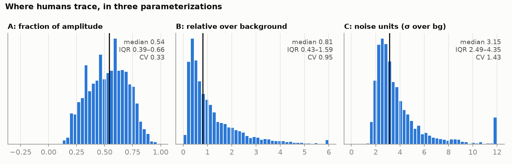
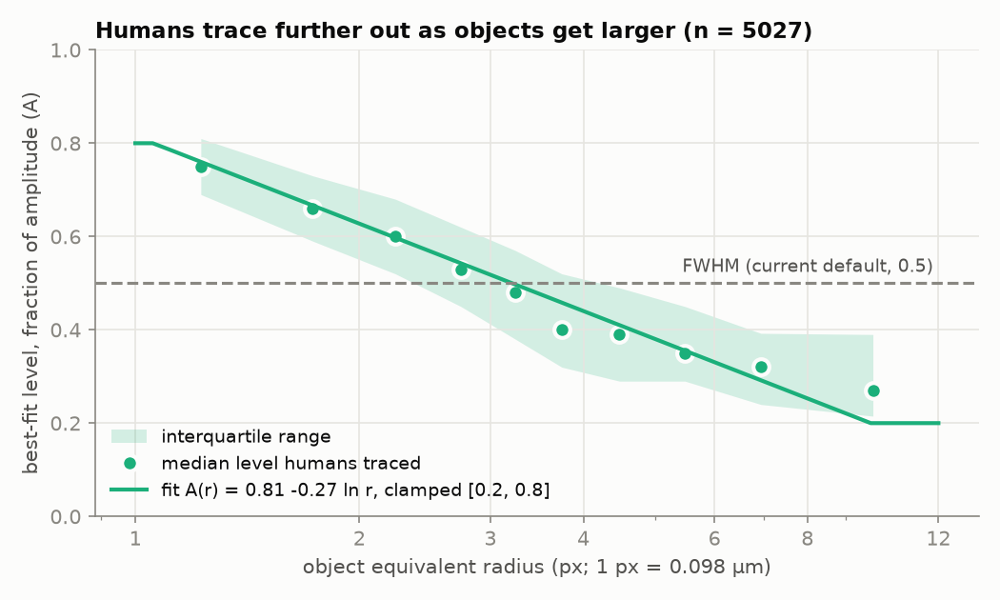
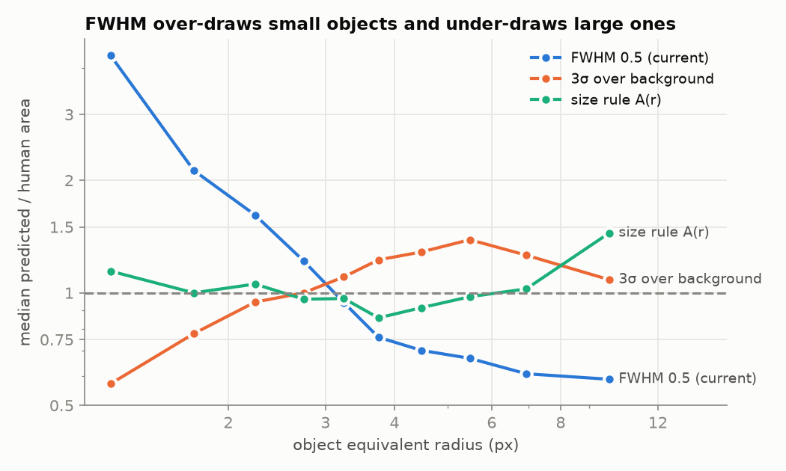
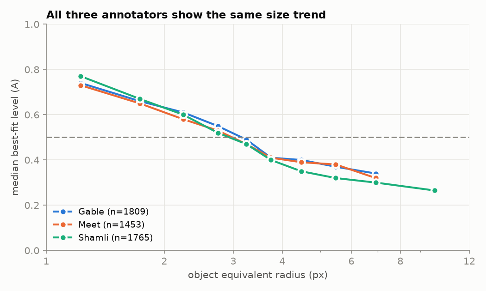

# Phase 1 report — the level humans trace at (2D cellular fluorescence)

Spec: `PyCAT_2D_Cellular_Region_Selection_Spec.md`, Phase 1. Code: `benchmarks/mask_level_calibration.py`
(per-object data: `benchmarks/mask_level_objects.csv`; figures: `mask_level_calibration/`).
Phase 0 inventory: `benchmarks/mask_inventory.py` → `benchmarks/bio_gt_pairing.csv`, `bio_gt_objects.csv`.

## Bottom line

**Humans do not trace at a constant level. They trace at a level that falls with object size, and a
fixed half-maximum (the current `refit_level = 0.5`) is wrong in opposite directions at the two ends:**
it over-draws objects of radius < 3 px (median area ratio 2.2× at r < 2.5 px) and under-draws those
above 4 px (0.60–0.69×). The data support one recommended default:

> **A(r) = 0.815 − 0.270 · ln(r_eq), clamped to [0.20, 0.80]** — the level as a fraction of the
> object's own amplitude above its local background, r_eq the equivalent radius in px.

It brings the median predicted/human area ratio to **0.93–1.06 in every size bin** (FWHM: 0.60–2.20),
raises mean IoU against the human masks from 0.500 to 0.571, and holds up when fitted on two
annotators and scored on the third.

## Data (Phase 0, summarised)

- 27 fields (9 each Small / large / Irregular puncta), 512×512 int16, offset-subtracted, 0.0977 µm/px.
- Label masks from three annotators (Gable, Meet, Shamli) plus a consensus set; every pairing
  verified by pixel content; PNG/TIF copies identical.
- **n = 5,581 human-traced objects swept** (area ≥ 4 px); **5,027** have a level contour reaching
  IoU ≥ 0.5 with the human mask and are used for the fits. All rules are *scored* on all 5,581.
- Inter-annotator ceiling (Hungarian-matched objects): mean IoU 0.58–0.63 (Small), 0.67–0.70
  (large), 0.54–0.62 (Irregular).

## Method, and where it departs from the spec

For each object, on the raw GFP smoothed with σ = 1 px **exactly as `refit_object_boundaries` smooths
it**: background = 25th percentile of a ring of width max(3, 2 r_eq) with every annotated object
excluded, peak = 98th percentile inside the mask, noise σ from `robust_cell_background` on the same
ring. Sweep t = bg + a·(peak − bg), a ∈ [−0.30, 1.00] step 0.01; at each t take the connected
region holding the object's brightest pixel, fill holes, score IoU against the human mask.

Departures, all to make the answer transferable to the runtime:

- **Background is the refit's ring percentile, not `robust_cell_background`.** The spec assumed the
  refit used the sigma-clipped estimator; it doesn't (`boundary_refit._local_background`). A level
  calibrated against a different background would not mean the same thing when plugged in.
  `robust_cell_background` is still used for σ, which only parameterization C needs.
- **Peak is the 98th percentile** (the refit's `DEFAULT_PEAK_PERCENTILE`), not the spec's 99th.
- Detected objects are not excluded from the ring (no detection run in this phase); all four
  annotation sets are.
- No object hit the bottom of the sweep, so extending below the ring background was unnecessary but
  confirms humans never trace *past* it.

**Caveat that carries into Phase 2:** here the ring and anchor come from the human mask itself. At
runtime they come from the detection, and r_eq must come from the current boundary — the refit's
existing two-pass loop is the natural place to recompute it. The end-to-end number is Phase 2's to
measure.

## 1.2 Three parameterizations

| Parameterization | Median | IQR | CV | Robust CV (IQR/1.349/median) |
|---|---|---|---|---|
| **A — fraction of amplitude** | **0.54** | 0.39–0.66 | **0.33** | **0.37** |
| B — relative over background | 0.81 | 0.43–1.59 | 0.95 | 1.07 |
| C — noise units (σ over bg) | 3.15 | 2.49–4.35 | 1.43 | 0.44 |

**Winner by the spec's decision rule: A.** C is a close second on robust CV (its plain CV is
inflated by a long bright tail), and B is last on every measure.

The 5–10%-over-background prior (B ≈ 0.075) is **decisively rejected**: applied to every object it
draws masks at a median **13.8×** the human area, mean IoU 0.086. Humans trace at a median 81%
over local background, not 5–10%. This is a local-ring background in the nucleoplasm; a 5–10% rule
measured against a darker, whole-image background might look different, but it is not what the
refit would use.

Scored as rules on all 5,581 objects (mean IoU / median area ratio):

| Rule | all | r < 2.5 | 2.5–4 | 4–6 | ≥ 6 |
|---|---|---|---|---|---|
| FWHM, A = 0.50 (current) | 0.500 / 1.29 | 0.414 / 2.20 | 0.551 / 0.97 | 0.593 / 0.69 | 0.573 / 0.60 |
| A = 0.54 (median) | 0.508 / 1.09 | 0.454 / 1.83 | 0.545 / 0.86 | 0.565 / 0.63 | 0.538 / 0.55 |
| B = 0.81 (median) | 0.283 / 0.94 | 0.211 / 0.14 | 0.355 / 1.27 | 0.335 / 4.47 | 0.285 / 6.55 |
| C = 3.0 σ | 0.474 / 1.07 | 0.417 / 0.83 | 0.493 / 1.10 | 0.549 / 1.32 | 0.565 / 1.26 |
| **A(r), clamp [0.20, 0.80]** | **0.571 / 1.00** | **0.545 / 1.05** | **0.559 / 0.93** | **0.627 / 0.93** | **0.648 / 1.06** |
| per-object best (ceiling of a single level) | 0.747 / 0.97 | 0.704 / 1.00 | 0.752 / 0.96 | 0.816 / 0.97 | 0.830 / 0.97 |

Bin sizes (objects): r < 2.5 px 2,485; 2.5–4 px 1,717; 4–6 px 1,093; ≥ 6 px 286. The ≥ 8 px tail
of the figure below rests on ~44 objects, and the size rule's 1.45 area ratio there is the least
certain point in this report.

## 1.3 What the level depends on

**Size — real, monotonic, large.** Spearman ρ(A*, r) = −0.72. Median A* falls from 0.69 at
r = 1–2 px to 0.28 at r ≥ 8 px; the spec's prediction ("t* falls as objects get larger") holds.
Least squares on ln r: **A(r) = 0.815 − 0.270 ln r**. The clamp only matters outside the data
(A reaches 0.2 at r ≈ 9.7 px); [0.20, 0.80] and [0.25, 0.75] score identically.

**Noise — also real, and partly the same effect.** ρ(A*, SNR) = −0.77, and bigger objects are
brighter (ρ(r, SNR) = 0.62). Each survives controlling for the other (partial ρ: size −0.49, SNR
−0.59), so both carry information. A two-term fit A = 0.922 − 0.170 ln r − 0.109 ln SNR scores
0.595 mean IoU vs 0.571 for A(r). **I recommend A(r) alone:** the gain is small, and SNR depends
on the σ estimate, which the runtime computes from a detection-based ring and would add a second
source of drift. The two-term form is available if Phase 2 end-to-end shows room.

The physical reading: in noise units humans stop at ~3σ over background (C median 3.15), i.e. where
the object becomes indistinguishable from noise — the spec's hypothesis (b). A constant 3σ gets the
*overall* area right (1.07) but with the opposite size bias to FWHM (0.83 small, 1.26–1.32 mid), so
it is not the rule either.

**Display — no effect once size and SNR are accounted for.** Raw correlations exist (ρ = −0.52 with
peak / field max under a min–max display; −0.38 under 1–99%; −0.37 with field dynamic range), but
the partial correlation of A* with display brightness controlling for SNR and radius is **−0.02**,
and with field range **+0.07**. The colormap/display hypothesis (a) is not supported: objects that
*look* dim are traced differently because they *are* noisy, not because of how they are displayed.

**Annotators — statistically different, practically the same.** Kruskal–Wallis on A*: H = 64.8,
p = 8e-15 (medians Gable 0.55, Meet 0.49, Shamli 0.56) — significant only because n is large; the
size trend is the same for all three:

Leave-one-annotator-out, the size rule refits to nearly the same curve and beats FWHM on the
held-out annotator every time:

| Held out | Fitted on the other two | A(r) IoU / area ratio | FWHM IoU / area ratio |
|---|---|---|---|
| Gable | 0.822 − 0.281 ln r | 0.511 / 1.07 | 0.460 / 1.44 |
| Meet | 0.821 − 0.274 ln r | 0.620 / 0.94 | 0.572 / 1.00 |
| Shamli | 0.795 − 0.251 ln r | 0.599 / 1.00 | 0.487 / 1.40 |

## Against the ceiling

A(r) reaches mean IoU 0.571 against the pooled human masks. Two humans agree with each other at
0.54–0.70 (matched objects). A single-level contour, even with its best level chosen per object with
hindsight, reaches 0.747. So the size rule is already within the range of human–human agreement;
the remaining gap to 0.747 is per-object variation that neither size nor SNR explains, and chasing
it risks fitting individual annotators.

## Checks on the spec's own numbers

- **"0.79 small / 0.37 large" did not reproduce.** The manuscript's PyCAT masks
  (`Pycat masks/Downsampled masks`), matched object-by-object against consensus: median area ratio
  **0.60 Small, 0.68 large, 0.67 Irregular** (total-area ratio 0.55 / 0.75 / 0.67). They
  under-cover throughout, but not with the large-object collapse the spec quotes. Those masks come
  from an older version, not 1.6.460; the current pipeline's figure is Phase 2's baseline.
- **Two Small-puncta PyCAT mask files are misnumbered:** by pixel content, `In Cell 9-mask_512_downsampled.tif`
  is field 8 and `In Cell 10-mask_512_downsampled.tif` is field 9 (there is no field 10). Any
  manuscript comparison that paired these by filename compared fields 8 and 9 against the wrong
  ground truth.
- The spec's "large" regime is not large: large-puncta objects are mostly r = 2–8 px (median area
  53 px), against 10–20 px in `benchmarks/condensate_scale.py`'s synthetic "large".

## Recommendation for Phase 2

- Ladder target: **A(r) = 0.815 − 0.270 ln r_eq, clamped [0.20, 0.80]**, with r_eq recomputed from
  the current boundary each refit pass.
- The spec asked for B and C to be floored at 2–3σ. A is the chosen parameterization, and a 3σ floor
  on A(r) *hurts* (IoU 0.535, area ratio 0.75), because humans already stop near 3σ — a floor there
  bites the dim half of the population. Phase 2 should keep a floor only as a leak guard, set low
  (~1.5–2σ), and show it doesn't move the scores.
- No default has changed in this phase.

## Follow-up (same day): perception, and why IoU moves less than the area ratio

**Perceptual threshold — rejected.** Annotation was done on auto-contrasted (min–max) viridis.
Converting every traced edge into viridis CIE L* above the object's background, humans stop at a
median ΔL* = 9.3 (IQR 6.3–13.3), but that step still grows with object size (ρ = +0.66), and a
constant-ΔL* rule is the worst rule tested (mean IoU 0.390, area ratio 0.25 for r < 2.5 px up to
2.82 for r ≥ 6 px). The rank-based display test above is also unaffected by any monotonic
lightness curve. Neither the display nor the eye's response explains the size trend.

**Why mean IoU moves 0.500 → 0.571 while the median area ratio goes to 1.00.** The median balances
over- against under-drawn objects; per object, A(r) is still spread widely (area-ratio IQR
0.78–1.92, only 37% within ±25%), leaving a gap of ~0.18 IoU to the best single level in every size
bin. That gap is **not annotator noise**: on 3,935 pairs of the same object traced by two
annotators, their deviations from A(r) correlate at r = 0.80 (80% of the residual variance is a
property of the object). It is mostly **leakage**: 30% of objects are drawn > 1.5× too large, and
for 72% of those the contour more than doubles within one 0.01 level step — it has flooded into a
neighbour or textured nucleoplasm. Over-drawing tracks crowding: 37% of objects with a neighbour
within 4 radii, 9% beyond 10 radii.

**Estimated Phase 2 effect** (human-mask seeds, each annotator's other objects as neighbours;
freeze each object at the last level before its contour touches another object):

| Rule | mean IoU | median area ratio (IQR) | within ±25% |
|---|---|---|---|
| FWHM 0.5 | 0.506 | 1.25 (0.74–2.83) | 21% |
| A(r) | 0.575 | 1.00 (0.77–1.75) | 38% |
| **A(r) + fusion freeze** | **0.641** | 0.85 (0.69–1.05) | 45% |
| per-object best level | 0.747 | 0.97 (0.83–1.06) | 71% |

25% of objects are fusion-capped. With leakage blocked, the target can sit slightly further out: the
best of a coarse grid is A(r) = 0.815 − 0.324 ln r (IoU 0.652, area ratio 0.91–1.03 in every bin),
only +0.011 over the approved curve and fitted on the same data — so Phase 2 keeps the approved
A(r) and re-checks the slope leave-one-annotator-out once the real, detection-seeded ladder exists.
These are optimistic (seeds are the human masks); the runtime numbers are Phase 2's to measure.
