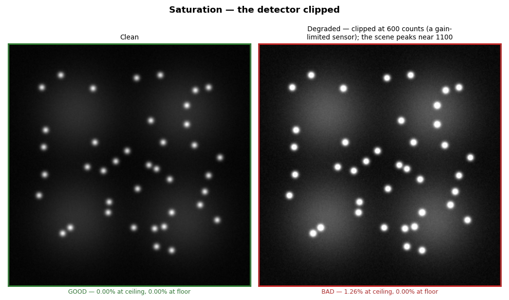
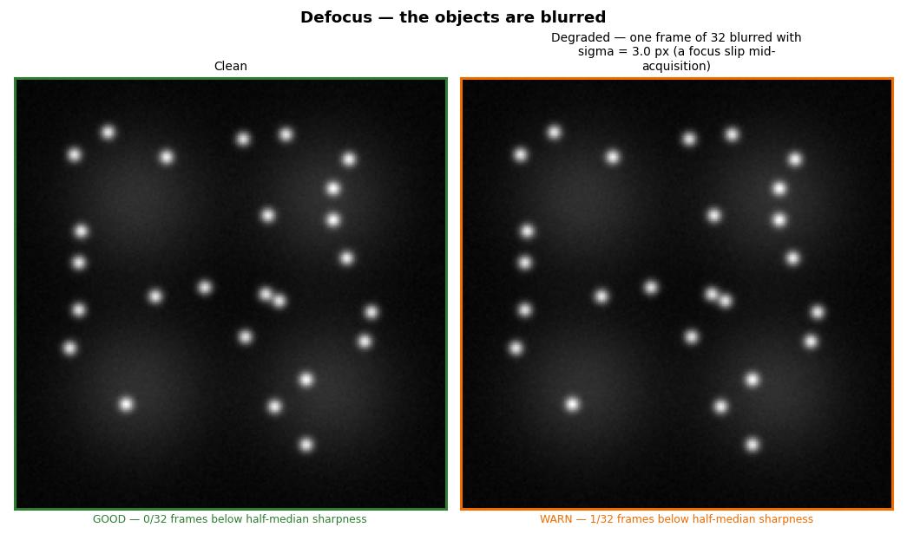
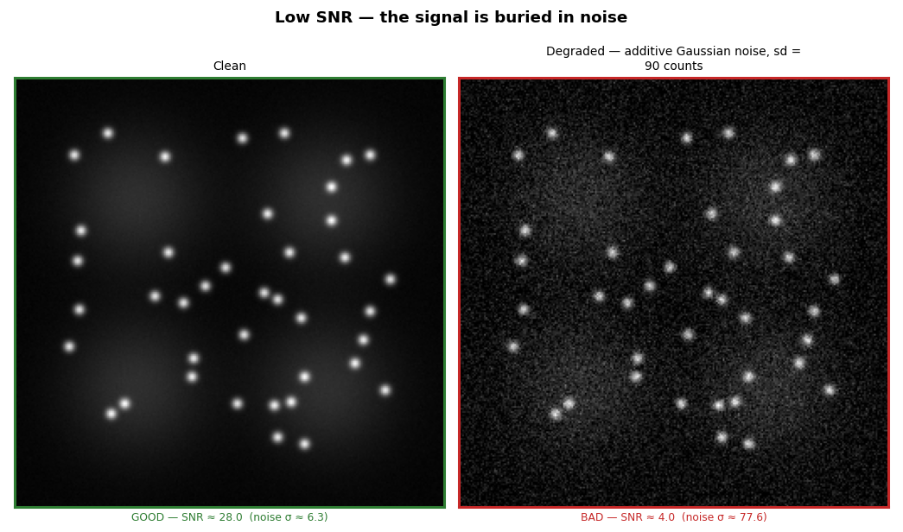
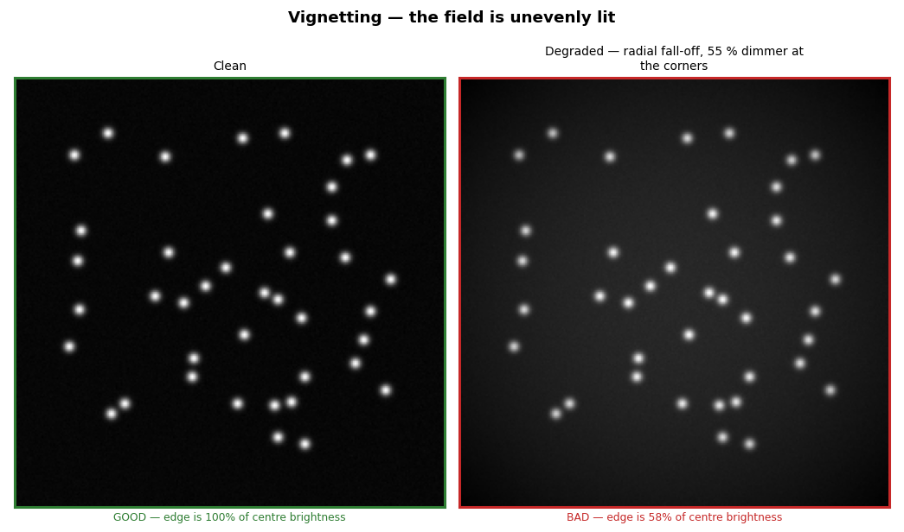
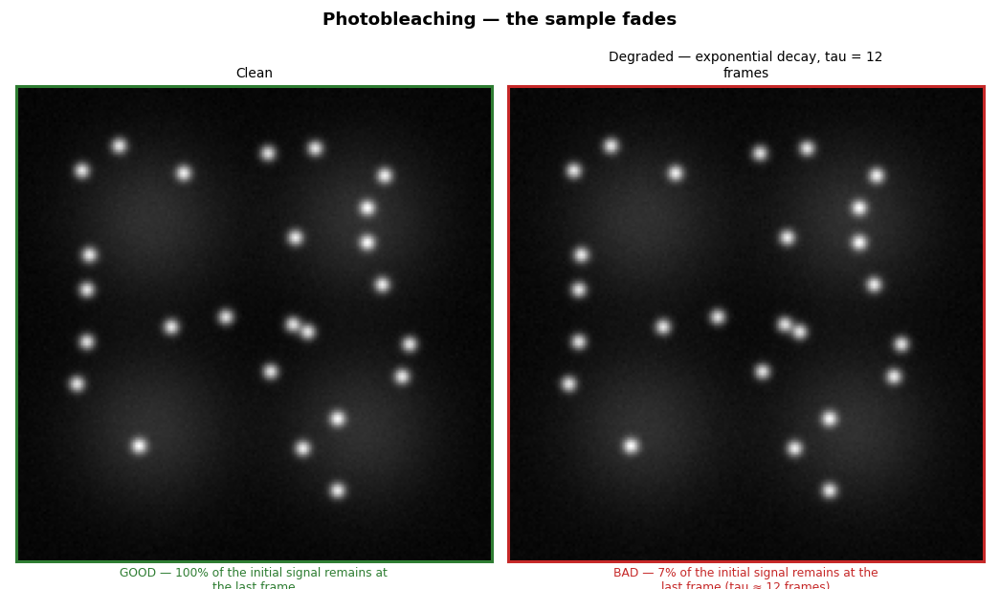
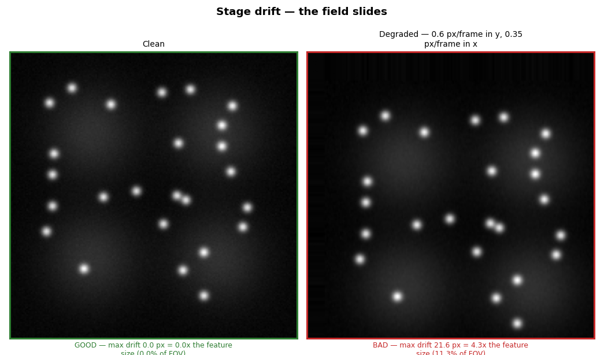
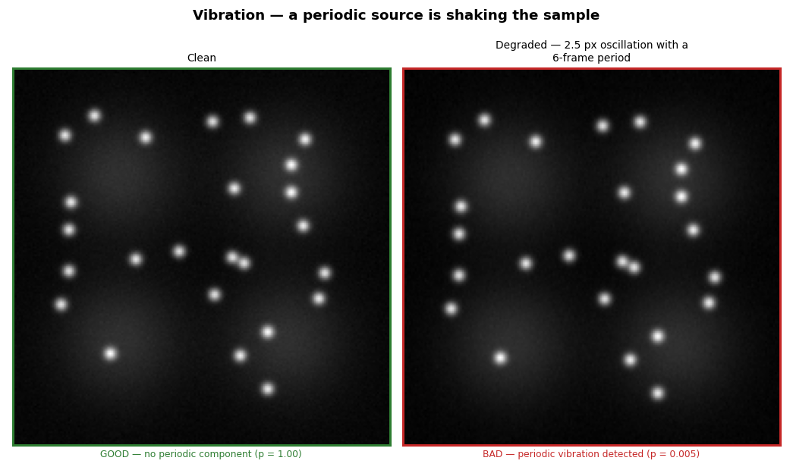

# What a quality problem looks like

Each panel below shows a **clean** acquisition beside one carrying a single, known defect — and what PyCAT's QC says about each.

> **These images are SIMULATED.** They are reference exemplars, generated with a known physical corruption, so that a scientist can see what a defect looks like and how their own data compares. **They are not an acquisition standard** — a real image is not expected to look like a synthetic one. Each caption gives the exact parameter that produced the defect.

The verdicts are **computed** — this page is generated by calling the real QC metrics on the real images. If a metric stopped detecting its own defect, the build would fail.

---

## Saturation — the detector clipped

*Simulated: clipped at 600 counts (a gain-limited sensor); the scene peaks near 1100. Detected by `qc_saturation`.*

**What it looks like.**  The brightest puncta are FLAT-TOPPED — their centres are all exactly the same value, and the peak has been sliced off.

**What it costs you.**  **This is the one defect that cannot be undone downstream.** The intensity is gone. A partition coefficient of 655, 1500 and 4000 all read as 655 once the dense phase clips — and the number is not a lower bound on anything, because the numerator was truncated by an unknown amount (1.5.392).

**How to fix it.**  Reduce the exposure or the gain until the brightest objects sit below the ceiling. Check the histogram for a spike at the maximum. **Do not** rescue a clipped acquisition by scaling it — the information is not there.

**Read more.**  [Clipping (photography)](https://en.wikipedia.org/wiki/Clipping_(photography)) · Waters, J. C. (2009). Accuracy and precision in quantitative fluorescence microscopy. *J. Cell Biol.* 185, 1135–1148. [doi](https://doi.org/10.1083/jcb.200903097)

> "Detectors have a limited capacity to hold electrons; if this capacity is reached, the corresponding pixel will be saturated... The linearity of the detector is therefore lost, and saturated images cannot be used for quantitation of fluorescence intensity values. Choosing to crop out saturated areas is not acceptable... because it will select for the weaker intensity parts of the specimen."

---

## Defocus — the objects are blurred

*Simulated: one frame of 32 blurred with sigma = 3.0 px (a focus slip mid-acquisition). Detected by `qc_focus`.*

**What it looks like.**  The puncta are wider and dimmer. Their edges are soft, and faint ones have merged into the background.

**What it costs you.**  Blur spreads each object into a **halo**, and the pixels immediately outside a mask are halo, not background. A client enrichment of 30 reads as **14.9** with a 5 px edge (1.5.460), and the dense–dilute contrast loses **22 %** (1.5.461). Small objects are lost entirely, which biases any size distribution upward.

**How to fix it.**  Refocus. If the field is only partly sharp, the coverslip is tilted or the sample is not flat. For a stack, check that the focal drift correction is on.

**Read more.**  [Defocus aberration](https://en.wikipedia.org/wiki/Defocus_aberration) · North, A. J. (2006). Seeing is believing? A beginners' guide to practical pitfalls in image acquisition. *J. Cell Biol.* 172, 9–18. [doi](https://doi.org/10.1083/jcb.200507103)

---

## Low SNR — the signal is buried in noise

*Simulated: additive Gaussian noise, sd = 90 counts. Detected by `qc_snr`.*

**What it looks like.**  The background is grainy and the faint puncta are hard to separate from it by eye. The bright ones are still obvious — **which is the trap.**

**What it costs you.**  Segmentation finds objects in the noise and loses the faint real ones, so the population you measure is biased toward the bright. Every threshold becomes noise-dependent, and a measurement that is stable on clean data can swing with the noise level alone — a partition coefficient moved **323 → 22 with the noise level** when it was computed on a normalised image (1.5.424).

**How to fix it.**  Increase the exposure, the excitation power, or bin the camera. **Check for photobleaching first** — if the sample is fading, more power makes it worse.

**Read more.**  [Signal-to-noise ratio](https://en.wikipedia.org/wiki/Signal-to-noise_ratio) · Waters, J. C. (2009). Accuracy and precision in quantitative fluorescence microscopy. *J. Cell Biol.* 185, 1135–1148. [doi](https://doi.org/10.1083/jcb.200903097)

---

## Vignetting — the field is unevenly lit

*Simulated: radial fall-off, 55 % dimmer at the corners. Detected by `qc_vignetting`.*

**What it looks like.**  The centre is bright and the corners are dark. **Compare the same puncta at the edge and in the middle** — they are the same objects, imaged differently.

**What it costs you.**  Any measurement that compares objects **across the field** is comparing illumination, not biology. Cells at the edge look dimmer, so an intensity threshold selects the ones in the middle, and an enrichment measured against a global background is wrong everywhere except the centre.

**How to fix it.**  Acquire a flat-field reference (an even fluorescent slide) and divide by it. Check the lamp alignment and that the field diaphragm is opened past the camera chip.

**Read more.**  [Vignetting](https://en.wikipedia.org/wiki/Vignetting) · Jonkman, J. et al. (2020). Tutorial: guidance for quantitative confocal microscopy. *Nat. Protoc.* 15, 1585–1611. [doi](https://doi.org/10.1038/s41596-020-0313-9)

---

## Photobleaching — the sample fades

*Simulated: exponential decay, tau = 12 frames. Detected by `qc_photobleaching`.*

**What it looks like.**  The first frame is bright and the last is dim. Scrub through the stack: the objects do not move, they fade.

**What it costs you.**  A bleach correction divides by exp(-t/tau), so **an error in tau compounds exponentially**. On a movie a fifth of the bleach time, tau fits to 11 s against a true 50 — and the final frame is over-corrected by **96 %**, nearly doubling it (1.5.451). In FRAP, uncorrected acquisition bleaching makes the plateau sag, and the fit reads that as a **2.5× faster recovery** with a mobile fraction 31 % too low — at R² = 0.94 (1.5.455).

**How to fix it.**  Reduce the excitation power or the frame rate. For FRAP, **acquire a reference region** that the bleach pulse did not hit — it measures the acquisition bleaching directly, and PyCAT corrects with it.

**Read more.**  [Photobleaching](https://en.wikipedia.org/wiki/Photobleaching) · Jost, A. P.-T. & Waters, J. C. (2019). Designing a rigorous microscopy experiment: validating methods and avoiding bias. *J. Cell Biol.* 218, 1452–1466. [doi](https://doi.org/10.1083/jcb.201812109)

---

## Stage drift — the field slides

*Simulated: 0.6 px/frame in y, 0.35 px/frame in x. Detected by `qc_drift`.*

**What it looks like.**  Scrub through: everything moves together, smoothly, in one direction. The objects do not move relative to each other.

**What it costs you.**  Drift is **ballistic** — it adds (v·tau)² to the MSD, which grows as tau² and pushes the anomalous exponent toward 2. In a viscous condensate, **50 nm/s of drift triples D and drives alpha to 1.91** — which reads as *directed, active transport*. It is the stage. And R² does not move (1.5.456).

**How to fix it.**  Let the stage and the sample come to thermal equilibrium before acquiring — most drift is thermal. Use hardware focus lock if available. PyCAT can subtract the common-mode motion, but **a correction is not a substitute for a stable stage**.

**Read more.**  [Image stabilization](https://en.wikipedia.org/wiki/Image_stabilization) · Jonkman, J. et al. (2020). Tutorial: guidance for quantitative confocal microscopy. *Nat. Protoc.* 15, 1585–1611. [doi](https://doi.org/10.1038/s41596-020-0313-9)

---

## Vibration — a periodic source is shaking the sample

*Simulated: 2.5 px oscillation with a 6-frame period. Detected by `qc_vibration`.*

**What it looks like.**  Scrub through: the field oscillates back and forth at a regular rhythm — unlike drift, it returns.

**What it costs you.**  Periodic displacement adds a spurious oscillation to every trajectory, and blurs each frame over the exposure. It is **distinct from drift**, and the fix is different: PyCAT tests for periodicity against a permutation null precisely so that random jitter and smooth drift do not send you looking for a pump that does not exist (1.5.419/420).

**How to fix it.**  Find the source: a pump, a fan, a compressor, footsteps, a nearby lift. An air table helps only if the source is floor-borne — an on-table pump needs isolating or turning off.

**Read more.**  [Vibration isolation](https://en.wikipedia.org/wiki/Vibration_isolation) · North, A. J. (2006). Seeing is believing? A beginners' guide to practical pitfalls in image acquisition. *J. Cell Biol.* 172, 9–18. [doi](https://doi.org/10.1083/jcb.200507103)

---

## A caveat the gallery itself taught us

The vignetting exemplar uses a **flat background**, not the four-cell reference scene — because four cells arranged in a ring **genuinely are a radial intensity pattern**, and `qc_vignetting` reads that clean scene as *bad*.

**The metric is not wrong. The scene is.** This is a real caveat for a sparse field: if your cells happen to sit toward the centre, a vignetting score will say so, and it is reporting where your cells are rather than how your lamp is behaving. Acquire a flat-field reference if the answer matters.
